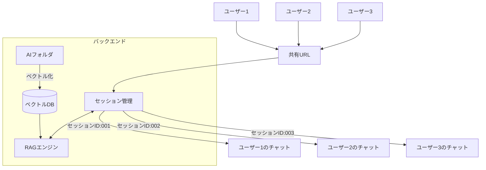
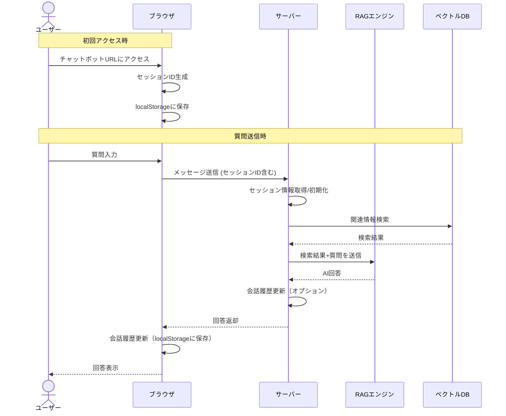

# RAGを活用したAIチャットボットの共有と独立セッション管理

## 概要

RAG（Retrieval Augmented Generation）を活用したAIチャットボットを構築し、URLで共有可能にする際、各ユーザーごとに独立したチャットセッションを持たせる方法についてまとめました。

## システム構成

### 基本コンセプト

- AIフォルダ内のファイルをベクトル化し、ベクトルデータベースに格納
- 1つのAIフォルダに対して1つのAIチャットボットを作成
- チャットボットごとに固有のURLを発行して共有可能
- URLにアクセスした各ユーザーは独立したチャットセッションを持つ

### システム構成図



## セッション管理の実装

### 1. セッションID管理方式

**クライアント側（フロントエンド）**:
- 初回アクセス時にセッションIDを自動生成
- ブラウザのlocalStorageやsessionStorageに保存
- 以降のAPIリクエスト時にIDをヘッダーやリクエストボディに含める

```javascript
// セッションID生成（初回アクセス時）
const sessionId = crypto.randomUUID();
localStorage.setItem('chatSessionId', sessionId);

// APIリクエスト時に送信
fetch('/api/chat', {
  method: 'POST',
  headers: {
    'Content-Type': 'application/json',
    'X-Session-ID': localStorage.getItem('chatSessionId')
  },
  body: JSON.stringify({ message: userInput })
});
```

**サーバー側（バックエンド）**:
- リクエストからセッションIDを取得
- セッションIDごとに会話コンテキストを管理

```javascript
// セッションストア（メモリ内）
const sessions = new Map();

// リクエスト処理
app.post('/api/chat', (req, res) => {
  const sessionId = req.headers['x-session-id'];
  const userMessage = req.body.message;
  
  // セッション初期化（存在しない場合）
  if (!sessions.has(sessionId)) {
    sessions.set(sessionId, { 
      messages: [],
      botId: req.params.botId // どのAIチャットボットを使用するか
    });
  }
  
  // 以降の処理...
});
```

### 2. 会話履歴管理の実装方法

会話の永続化が**不要**な場合、以下の2つの方法があります：

#### 2.1 クライアント側のみで履歴管理

- 会話履歴をブラウザのlocalStorageに保存
- サーバー側は各リクエストを独立して処理（ステートレス）

```javascript
// クライアント側での会話履歴保存
function saveConversation(messages) {
  localStorage.setItem('chatHistory', JSON.stringify(messages));
}

// 会話履歴の読み込み
function loadConversation() {
  const saved = localStorage.getItem('chatHistory');
  return saved ? JSON.parse(saved) : [];
}
```

#### 2.2 サーバー側での一時的なメモリ内状態管理

- サーバーメモリ内にセッションごとの会話履歴を保持
- データベースは不要

```javascript
// メッセージを追加して保存
const sessionData = sessions.get(sessionId);
sessionData.messages.push(
  { role: 'user', content: userMessage },
  { role: 'assistant', content: aiResponse }
);
sessions.set(sessionId, sessionData);
```

### 3. 処理フロー



## 重要なポイント

1. **データベース不要**:
   - 会話履歴を永続化する必要がない場合、データベースは必須ではない
   - クライアント側（localStorage）またはサーバー側（メモリ内）で一時的に会話を管理可能

2. **複数ユーザーの同時接続**:
   - セッションIDにより各ユーザーのコンテキストを分離するため問題なし
   - 小～中規模のシステムであれば、特別なメッセージブローカーも不要

3. **シンプルなURL**:
   - URLにはセッション情報を含める必要なし（`https://example.com/ai-chat/finance-bot`）
   - 共有も容易で、アクセスする各ユーザーは自動的に新規セッションで開始

4. **スケーラビリティ**:
   - サーバー側でメモリ内セッション管理を行う場合、大規模なシステムではRedisなどのインメモリキャッシュの使用を検討
   - マイクロサービスアーキテクチャや高可用性が必要な場合はメッセージブローカーの導入も選択肢

## まとめ

RAGを活用したAIチャットボットを共有URLで提供しつつ、各ユーザーに独立したチャットセッションを持たせる実装は十分に可能です。会話履歴の永続化が不要な場合は、クライアント側のストレージやサーバー側のメモリ内データ構造を利用することで、データベースなしでもシンプルに実現できます。

この方法により、ナレッジベース（AIフォルダのベクトル化されたファイル）は共通のまま、各ユーザーの会話体験を個別化することができます。また、URLもシンプルに保つことができるため、共有も容易です。