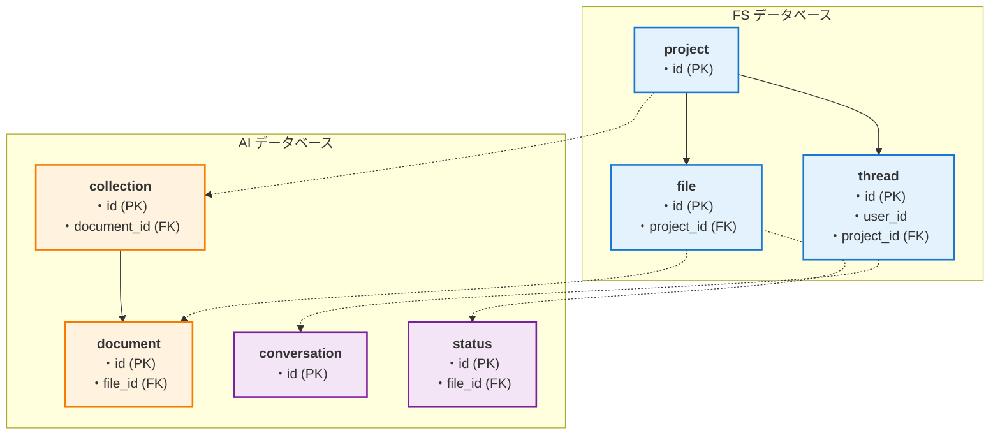

```mermaid
graph TD
    subgraph FS["FS データベース"]
        FS_project["`**project**
        ・id (PK)`"]

        FS_file["`**file**
        ・id (PK)
        ・project_id (FK)`"]

        FS_thread["`**thread**
        ・id (PK)
        ・user_id
        ・project_id (FK)`"]
        
        FS_project --> FS_file
        FS_project --> FS_thread
    end
    
    subgraph AI["AI データベース"]
        AI_collection["`**collection**
        ・id (PK)
        ・document_id (FK)`"]

        AI_document["`**document**
        ・id (PK)
        ・file_id (FK)`"]

        AI_conversation["`**conversation**
        ・id (PK)`"]

        AI_status["`**status**
        ・id (PK)
        ・file_id (FK)`"]
        
        AI_collection --> AI_document
    end
    
    %% 関係性の線
    FS_project -.-> AI_collection
    FS_file -.-> AI_document
    FS_file -.-> AI_status
    FS_thread -.-> AI_conversation
    
    %% 色の定義
    classDef fsDB fill:#e3f2fd,stroke:#1976d2,stroke-width:2px
    classDef aiDB fill:#f3e5f5,stroke:#7b1fa2,stroke-width:2px
    classDef vector fill:#fff3e0,stroke:#f57c00,stroke-width:2px
    
    %% 色の適用
    class FS_project,FS_file,FS_thread fsDB
    class AI_conversation,AI_status aiDB
    class AI_collection,AI_document vector
```