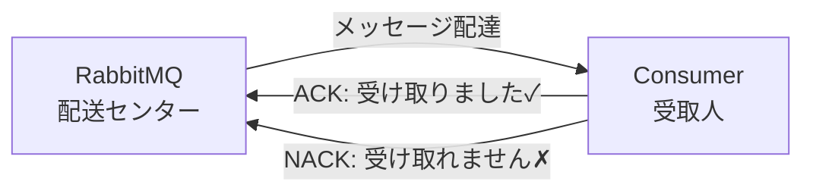
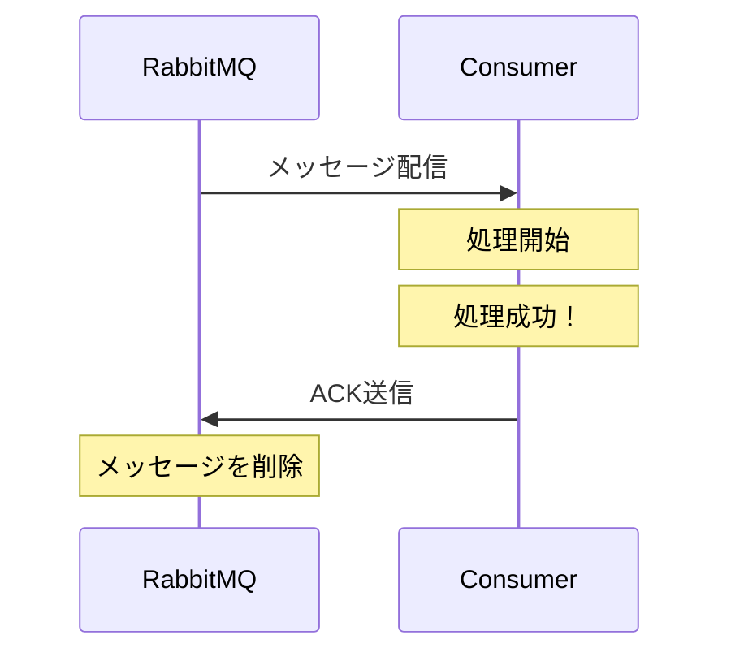
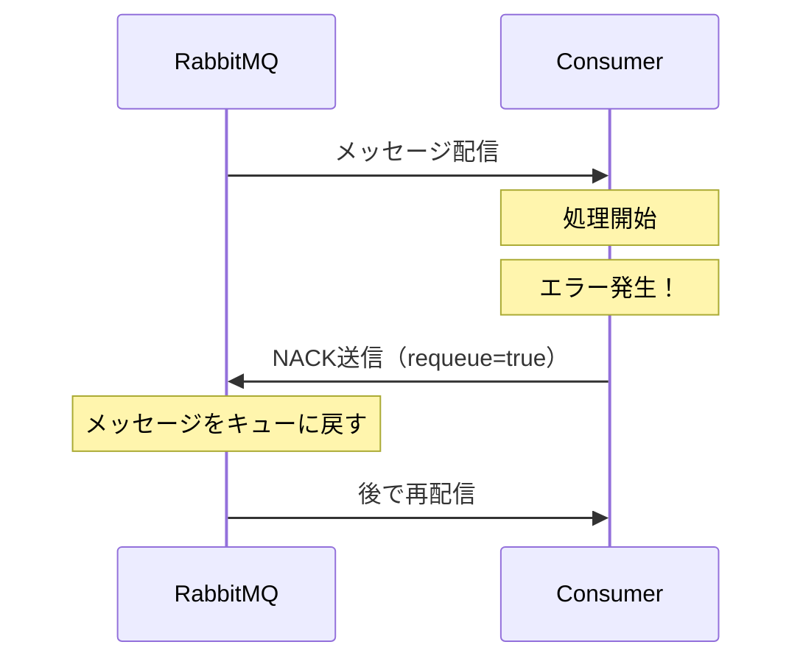
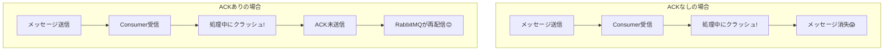

## RabbitMQ の ACK と NACK の仕組み 📮

### 基本概念：配達確認システム 📦

RabbitMQのACK/NACKは、**宅配便の受取確認**のような仕組みです。



### ACK（Acknowledgment）= 正常受領の通知 ✅



**ACKが送信されるタイミング**：
- ファイル処理が**完全に成功**した時
- データベースへの保存が**完了**した時
- エラーなく処理が**終了**した時

### NACK（Negative Acknowledgment）= 受領拒否の通知 ❌



**NACKが送信されるタイミング**：
- 処理中に**エラー**が発生した時
- データベースへの接続が**失敗**した時
- 一時的な問題で処理を**再試行**したい時

### ACK/NACKがない場合の問題 ⚠️



### 3つのACKモード 🔧

#### 1. 自動ACK（Auto ACK）
```
RabbitMQ → Consumer: メッセージ配信と同時に削除
リスク: 処理失敗してもメッセージが消える
```

#### 2. 手動ACK（Manual ACK）- 推奨 ⭐
```
RabbitMQ → Consumer: メッセージ配信
Consumer: 処理実行
Consumer → RabbitMQ: 成功時のみACK送信
```

#### 3. NACKオプション
```python
# requeue=True: キューに戻す（別のConsumerが処理可能）
# requeue=False: Dead Letter Queueへ送る
```

### 実際の動作例 🎬

#### ケース1: 正常処理
```
1. [Queue] ファイルAのメッセージ
2. [KnowledgeController] メッセージ受信・処理開始
3. [KnowledgeController] エンベディング完了
4. [KnowledgeController] pgvectorに保存完了
5. [KnowledgeController] → [Queue] ACK送信
6. [Queue] メッセージ削除
```

#### ケース2: エラー発生
```
1. [Queue] ファイルBのメッセージ
2. [KnowledgeController] メッセージ受信・処理開始
3. [KnowledgeController] pgvector接続エラー！
4. [KnowledgeController] → [Queue] NACK送信（requeue=true）
5. [Queue] メッセージをキューに戻す
6. [Queue] 後で再配信
```

#### ケース3: Consumer停止
```
1. [Queue] ファイルCのメッセージ
2. [KnowledgeController] メッセージ受信・処理開始
3. [KnowledgeController] 突然停止！（ACK未送信）
4. [Queue] 接続断を検知
5. [Queue] メッセージを自動的にキューに戻す
6. [Queue] 新しいConsumerに配信
```

### まとめ：なぜACK/NACKが重要か 🎯

| 機能 | メリット |
|-----|---------|
| **信頼性** | メッセージが確実に処理されるまで保持 |
| **耐障害性** | Consumer障害時も自動リカバリ |
| **柔軟性** | エラー時の再試行/スキップを選択可能 |
| **可視性** | どのメッセージが処理済みか明確 |

ACK/NACKは、分散システムにおいて**「メッセージを絶対に失わない」**ための重要な仕組みです。