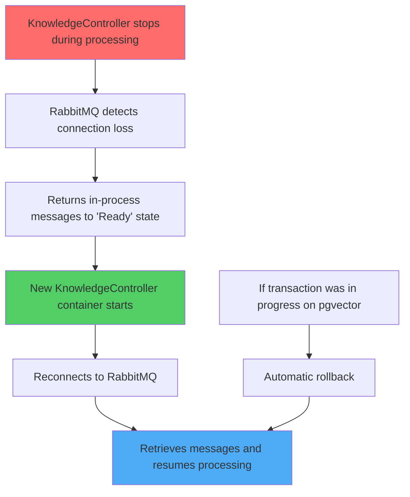
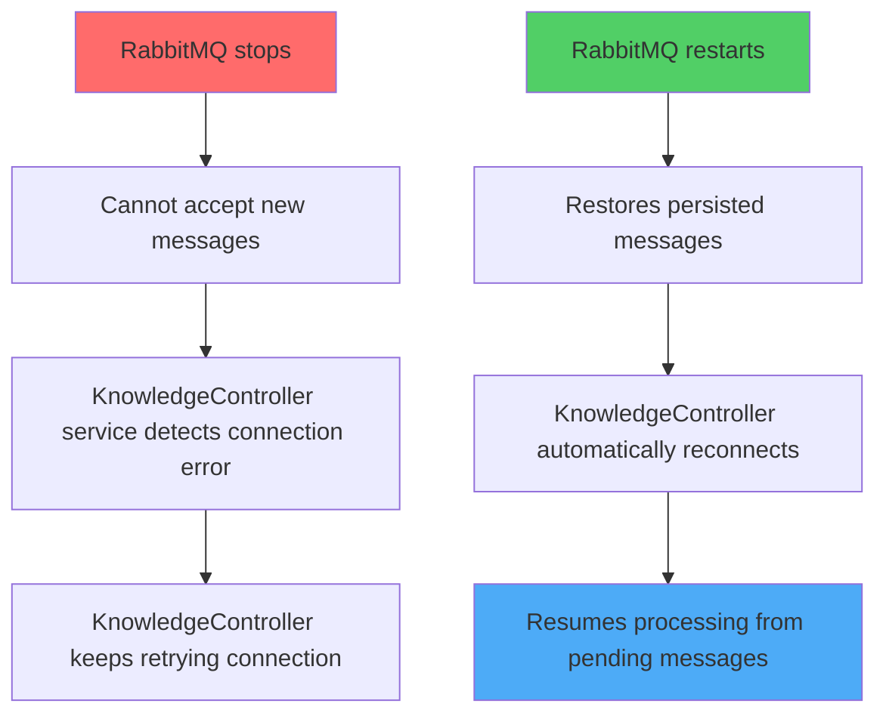
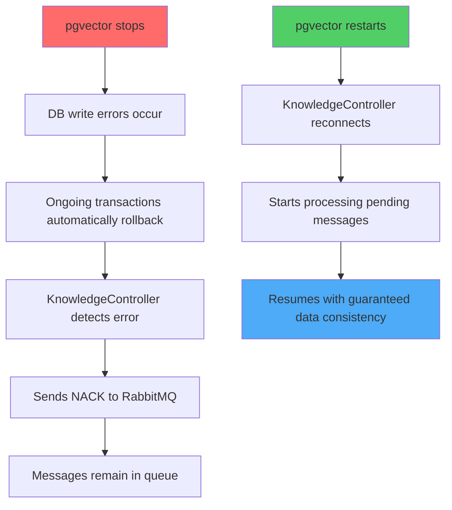
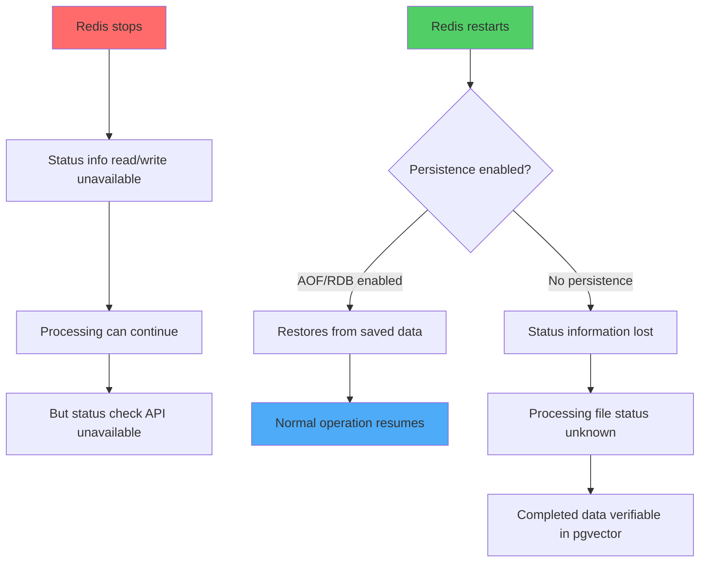

## Recovery Flow for Each Container Failure 🔄

### 1. KnowledgeController Service Container Failure 🛑

**Impact Scope**: Only files being processed
**Data Loss**: None (rolled back by transaction)
**Recovery Time**: Several seconds to tens of seconds

---

### 2. RabbitMQ Container Failure 📬

**Impact Scope**: New file processing stops
**Data Loss**: None (messages are persisted)
**Recovery Time**: Depends on RabbitMQ startup time

---

### 3. pgvector Container Failure 💾

**Impact Scope**: All DB write operations
**Data Loss**: None (protected by transactions)
**Recovery Time**: DB startup time + connection pool reconstruction

---

### 4. Redis Container Failure 🔴

**Impact Scope**: Status check functionality only
**Data Loss**: Depends on persistence settings (main data unaffected)
**Recovery Time**: Immediate (no persistence) ~ few seconds (with persistence)

---

### Multiple Container Failures 🔥

| Failure Pattern | Impact | Recovery Priority |
|-----------------|--------|-------------------|
| pgvector + Redis | All processing stops | 1. pgvector → 2. Redis |
| RabbitMQ + KnowledgeController | All processing stops | 1. RabbitMQ → 2. KnowledgeController |
| All containers | Complete system down | 1. pgvector → 2. Redis → 3. RabbitMQ → 4. KnowledgeController |

### Key Points 📌

1. **Data Integrity**: Data consistency is guaranteed in all patterns
2. **Automatic Recovery**: All cases can auto-recover without manual intervention
3. **Idempotent Processing**: Processing the same file multiple times yields the same result
4. **Observability**: Final state can be verified from pgvector even if Redis is down