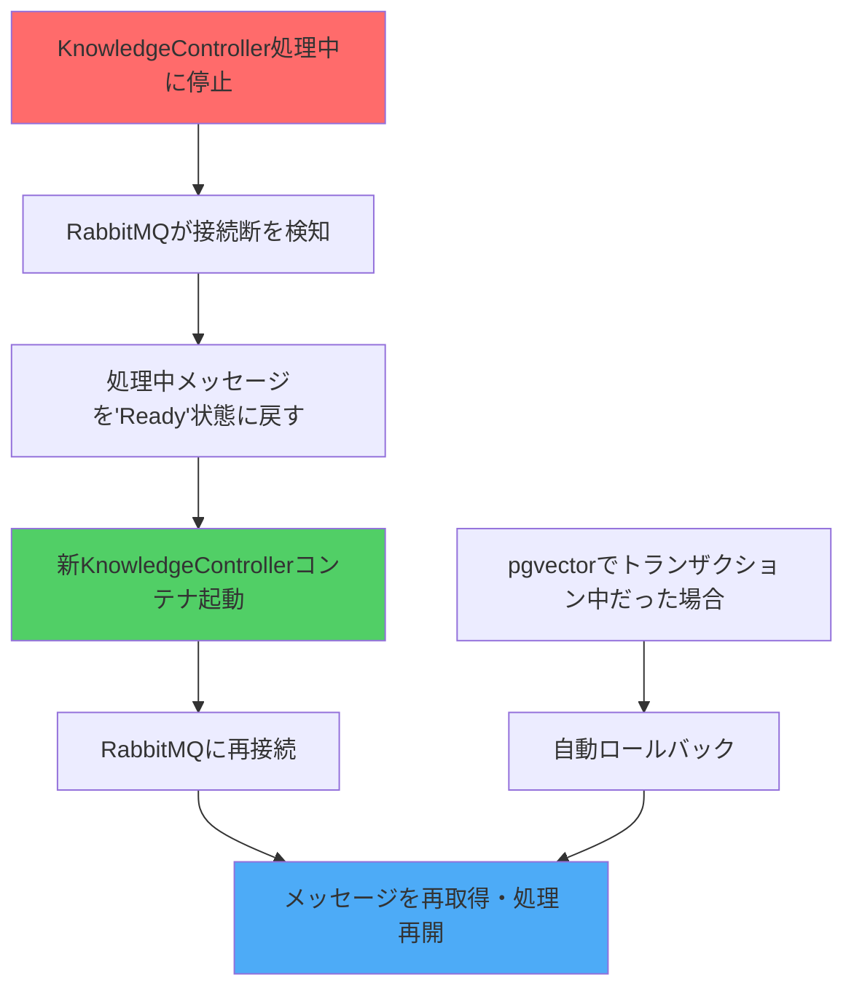
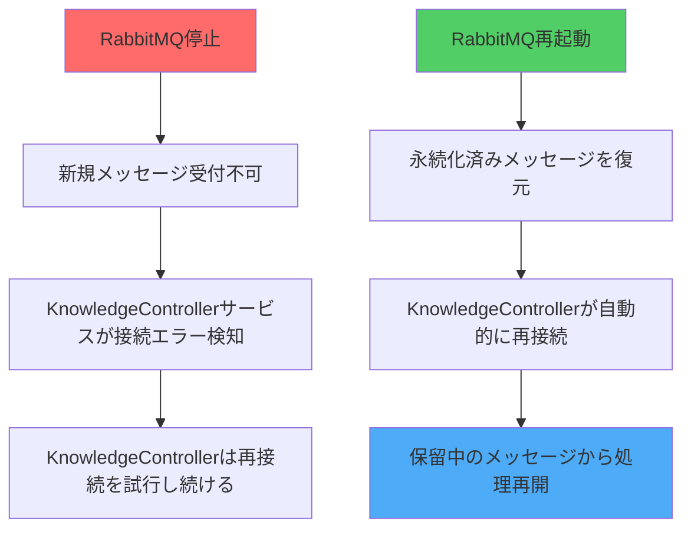
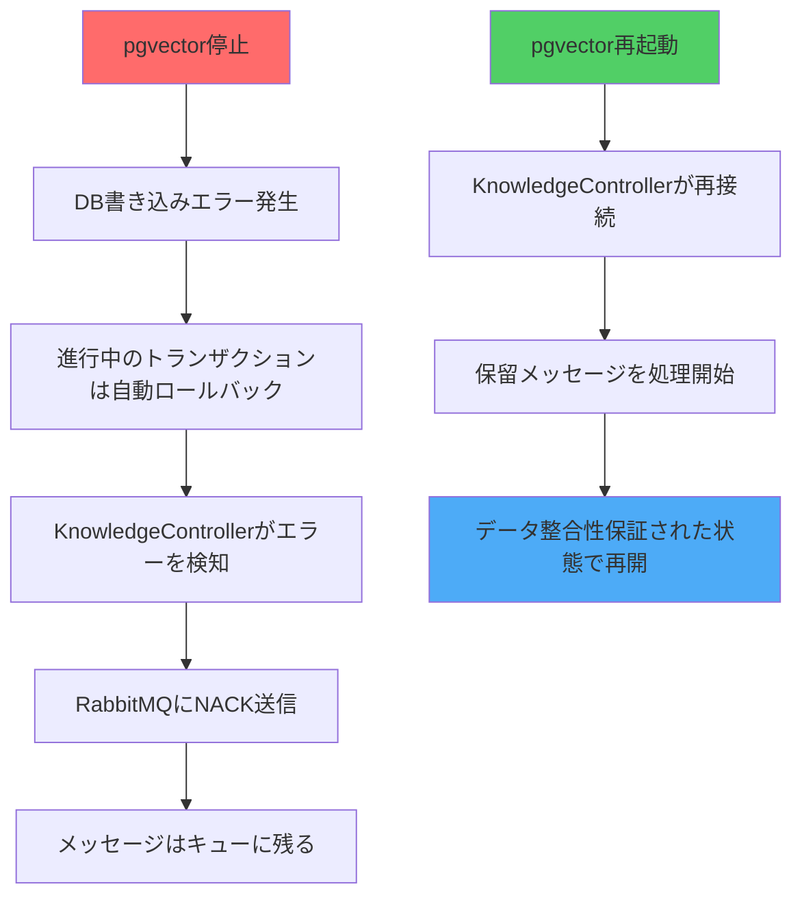
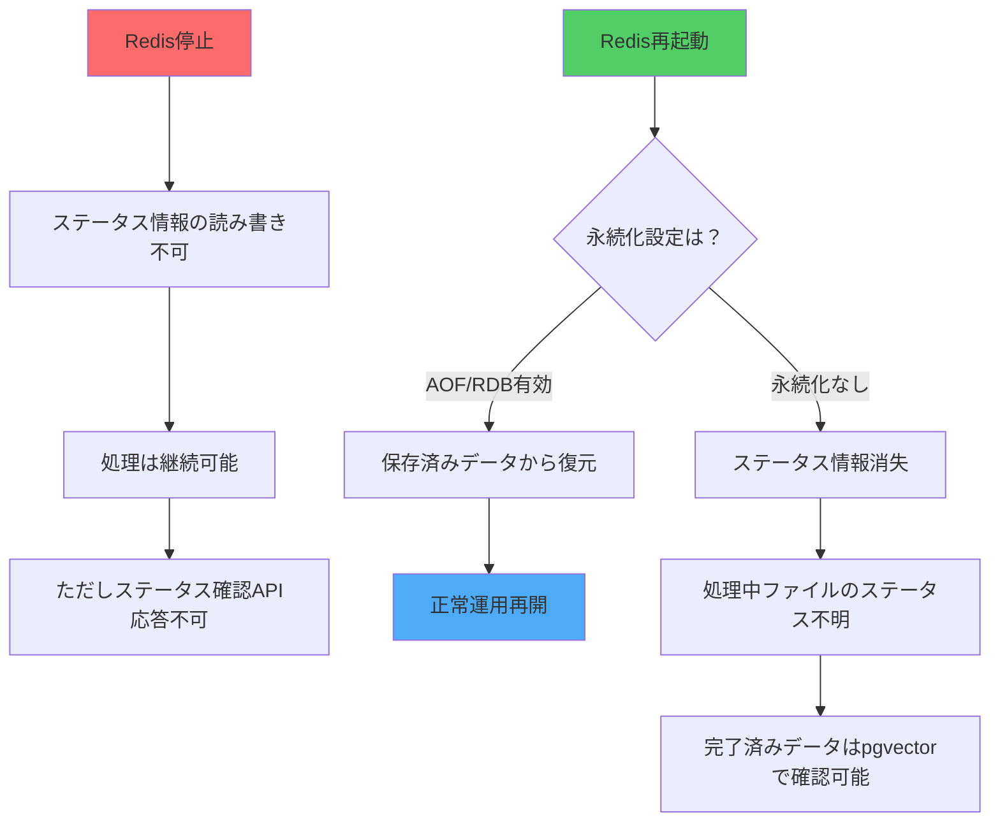

## 各コンテナ停止時の復旧フロー 🔄

### 1. KnowledgeController Service コンテナ停止時 🛑

**影響範囲**：処理中のファイルのみ
**データ損失**：なし（トランザクションでロールバック）
**復旧時間**：数秒〜数十秒

---

### 2. RabbitMQ コンテナ停止時 📬

**影響範囲**：新規ファイル処理の受付停止
**データ損失**：なし（メッセージは永続化済み）
**復旧時間**：RabbitMQ起動時間に依存

---

### 3. pgvector コンテナ停止時 💾

**影響範囲**：全てのDB書き込み処理
**データ損失**：なし（トランザクションで保護）
**復旧時間**：DB起動時間 + 接続プール再構築

---

### 4. Redis コンテナ停止時 🔴

**影響範囲**：ステータス確認機能のみ
**データ損失**：永続化設定次第（本体データは無事）
**復旧時間**：即座（永続化なし）〜 数秒（永続化あり）

---

### 複数コンテナ同時停止時 🔥

| 停止パターン | 影響 | 復旧優先順位 |
|------------|------|-------------|
| pgvector + Redis | 全処理停止 | 1. pgvector → 2. Redis |
| RabbitMQ + KnowledgeController | 全処理停止 | 1. RabbitMQ → 2. KnowledgeController |
| 全コンテナ | システム完全停止 | 1. pgvector → 2. Redis → 3. RabbitMQ → 4. KnowledgeController |

### 重要ポイント 📌

1. **データ整合性**：どのパターンでも最終的なデータ整合性は保証される
2. **自動復旧**：全てのケースで手動介入なしに自動復旧可能
3. **処理の冪等性**：同じファイルを複数回処理しても結果は同じ
4. **可観測性**：Redisが停止してもpgvectorから最終状態は確認可能