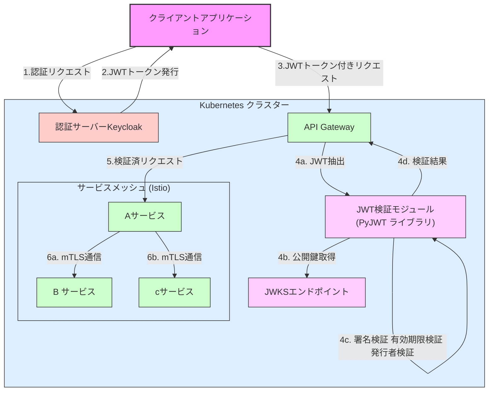

```mermaid
graph TD
    Client[クライアントアプリケーション] -->|1.認証リクエスト| Keycloak[認証サーバーKeycloak]
    Keycloak -->|2.JWTトークン発行| Client
    Client -->|3.JWTトークン付きリクエスト| Gateway[API Gateway]
    
    subgraph K8s["Kubernetes クラスター"]
        Gateway -->|4a. JWT抽出| JWT["JWT検証モジュール(PyJWT ライブラリ)"]
        JWT -->|4b. 公開鍵取得| JWKS[JWKSエンドポイント]
        JWT -->|4c. 署名検証 有効期限検証 発行者検証| JWT
        JWT -->|4d. 検証結果| Gateway
        
        Gateway -->|5.検証済リクエスト| A[Aサービス]
        
        A -->|6a. mTLS通信| B[B サービス]
        A -->|6b. mTLS通信| c[cサービス]
        
        subgraph ServiceMesh["サービスメッシュ (Istio)"]
            A
            B
            c
        end
        
        Keycloak
    end
    
    classDef external fill:#f9f,stroke:#333,stroke-width:2px;
    classDef k8s fill:#def,stroke:#333,stroke-width:1px;
    classDef service fill:#cfc,stroke:#333,stroke-width:1px;
    classDef auth fill:#fcc,stroke:#333,stroke-width:1px;
    classDef jwt fill:#fcf,stroke:#333,stroke-width:1px;
    
    class Client external;
    class K8s k8s;
    class Gateway,A,B,c service;
    class Keycloak auth;
    class ServiceMesh k8s;
    class JWT,JWKS jwt;
```