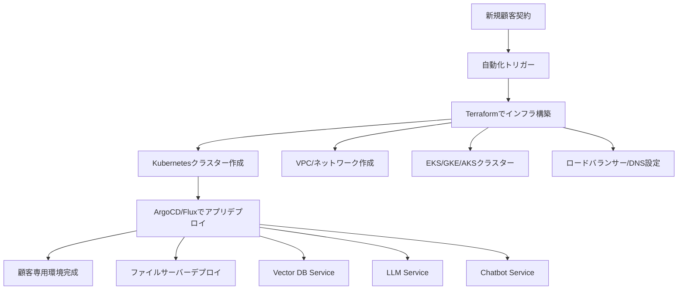
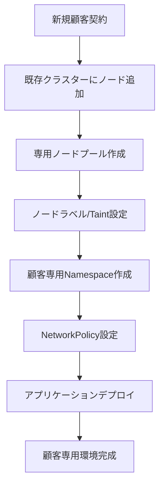
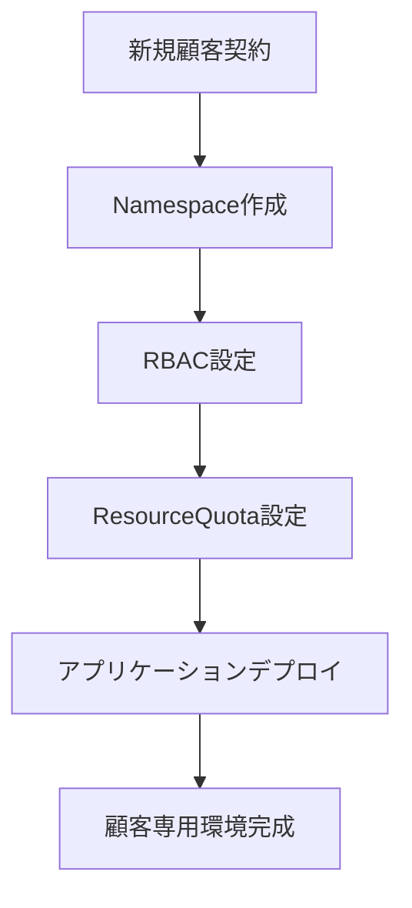

# テナント分離レベル別 環境構築自動化の実現性分析

## 自動化の目標
**「新規顧客契約時に、AIチャットボット付きファイルサーバー環境を自動構築」**

---

## レベル1: クラスター分離の自動化 🤖✅

### 自動化フロー


### 実装技術スタック
| コンポーネント | 技術選択肢 | 自動化レベル |
|----------------|------------|--------------|
| **インフラ管理** | Terraform, Pulumi, CDK | ⭐⭐⭐ 完全自動 |
| **K8sクラスター** | EKS, GKE, AKS | ⭐⭐⭐ 完全自動 |
| **アプリデプロイ** | ArgoCD, Flux, Helm | ⭐⭐⭐ 完全自動 |
| **DNS/証明書** | cert-manager, ExternalDNS | ⭐⭐⭐ 完全自動 |
| **監視設定** | Prometheus, Grafana | ⭐⭐⭐ 完全自動 |

### 自動化コード例
```yaml
# terraform/customer-cluster.tf
resource "aws_eks_cluster" "customer_cluster" {
  name     = "customer-${var.customer_id}"
  role_arn = aws_iam_role.cluster_role.arn
  
  vpc_config {
    subnet_ids = var.subnet_ids
  }
}

# helm/values-template.yaml
customerConfig:
  id: ${CUSTOMER_ID}
  domain: ${CUSTOMER_DOMAIN}
  storage:
    size: ${STORAGE_SIZE}
```

### 自動化所要時間
- **インフラ構築**: 15-30分
- **アプリケーションデプロイ**: 5-10分
- **合計**: **20-40分で完全環境構築**

### メリット・デメリット
✅ **メリット**:
- 完全に独立したリソースなので自動化が単純
- 失敗時の他顧客への影響なし
- テンプレート化が容易

❌ **デメリット**:
- 初期構築コストが高い（クラスター分×顧客数）
- リソースの最小単位が大きい

---

## レベル2: ノード分離の自動化 🤖⚠️

### 自動化フロー


### 実装技術スタック
| コンポーネント | 技術選択肢 | 自動化レベル |
|----------------|------------|--------------|
| **ノード管理** | Cluster Autoscaler, Karpenter | ⭐⭐⭐ 完全自動 |
| **ネットワーク分離** | Calico, Cilium NetworkPolicy | ⭐⭐ 要設定調整 |
| **リソース分離** | ResourceQuota, LimitRange | ⭐⭐⭐ 完全自動 |
| **アプリデプロイ** | ArgoCD, Helm | ⭐⭐⭐ 完全自動 |

### 自動化の複雑性
```yaml
# 複雑なネットワークポリシー例
apiVersion: networking.k8s.io/v1
kind: NetworkPolicy
metadata:
  name: customer-a-isolation
  namespace: customer-a
spec:
  podSelector: {}
  policyTypes:
  - Ingress
  - Egress
  ingress:
  - from:
    - namespaceSelector:
        matchLabels:
          customer: "customer-a"
  egress:
  - to:
    - namespaceSelector:
        matchLabels:
          customer: "customer-a"
```

### 自動化所要時間
- **ノードプール追加**: 5-15分
- **ネットワーク設定**: 2-5分
- **アプリケーションデプロイ**: 5-10分
- **合計**: **12-30分で環境構築**

### メリット・デメリット
✅ **メリット**:
- 既存クラスターに追加なので効率的
- コスト効率が良い

❌ **デメリット**:
- **ネットワーク設定が複雑** → 自動化の難易度アップ
- **障害時の影響範囲が広い** → 慎重な設定が必要
- **テスト・検証が複雑**

---

## レベル3: ネームスペース分離の自動化 🤖✅

### 自動化フロー


### 実装技術スタック
| コンポーネント | 技術選択肢 | 自動化レベル |
|----------------|------------|--------------|
| **Namespace管理** | kubectl, Kubernetes API | ⭐⭐⭐ 完全自動 |
| **RBAC** | Role, RoleBinding | ⭐⭐⭐ 完全自動 |
| **リソース制限** | ResourceQuota, LimitRange | ⭐⭐⭐ 完全自動 |
| **アプリデプロイ** | Helm, Kustomize | ⭐⭐⭐ 完全自動 |

### 自動化所要時間
- **Namespace作成**: 1分未満
- **アプリケーションデプロイ**: 3-5分
- **合計**: **5分未満で環境構築**

### メリット・デメリット
✅ **メリット**:
- **最も単純な自動化** → 確実に動作
- **最速の環境構築**
- **運用コストが最小**

❌ **デメリット**:
- **セキュリティリスクが高い**
- **性能隔離が困難**

---

## 自動化実現性の総合評価

| 分離レベル | 自動化難易度 | 構築時間 | 運用安定性 | セキュリティ企業適合性 |
|------------|--------------|----------|------------|----------------------|
| **クラスター分離** | ⭐⭐ 中程度 | 20-40分 | ⭐⭐⭐ 高 | ⭐⭐⭐ 最適 |
| **ノード分離** | ⭐ 困難 | 12-30分 | ⭐⭐ 中 | ⭐⭐ 要検討 |
| **ネームスペース分離** | ⭐⭐⭐ 簡単 | 5分未満 | ⭐⭐⭐ 高 | ❌ 不適合 |

---

## 推奨アプローチ: **クラスター分離**

### 理由
1. **自動化の確実性**: 独立リソースなので自動化が安定
2. **セキュリティ要件**: 情報漏洩リスクを最小化
3. **運用の単純性**: 各顧客環境が完全独立

### 実装ロードマップ
```
Phase 1: プロトタイプ構築 (2-4週間)
├── Terraformテンプレート作成
├── Helmチャート準備
└── CI/CDパイプライン構築

Phase 2: 自動化システム開発 (4-6週間)
├── 顧客管理API開発
├── 自動プロビジョニング機能
└── 監視・ログ統合

Phase 3: 本格運用開始 (2週間)
├── 初期顧客での検証
└── 運用手順確立
```

**結論**: クラスター分離は自動化可能であり、セキュリティ企業の要件に最も適合する選択肢です。