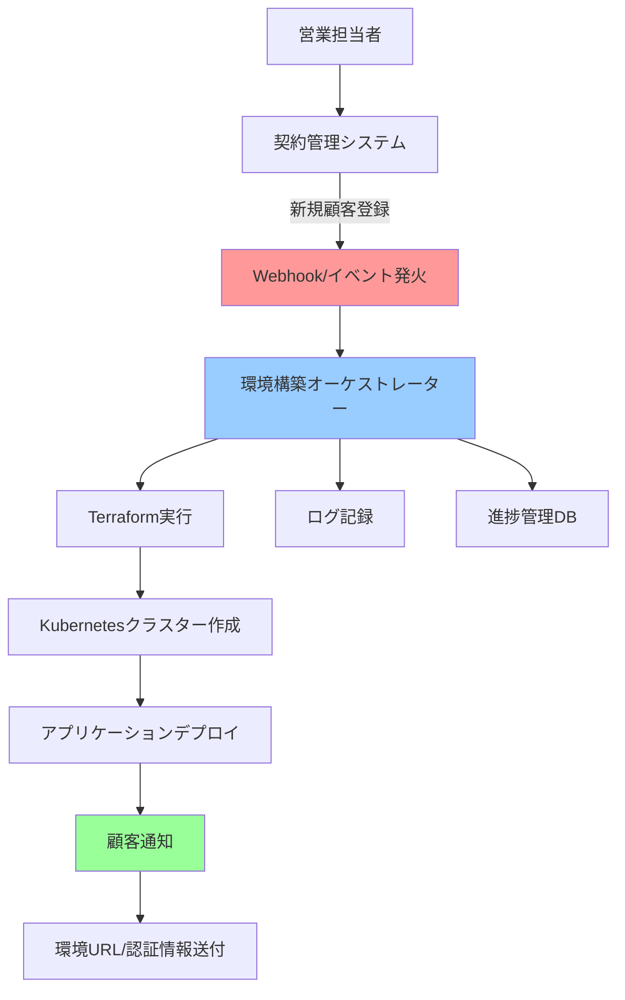
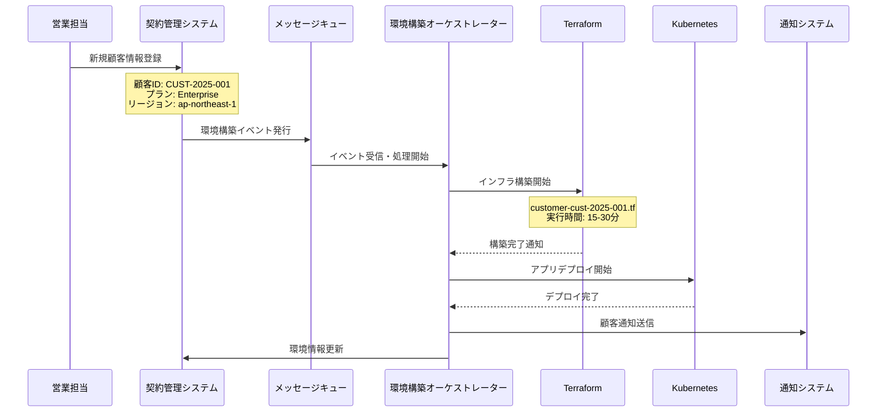
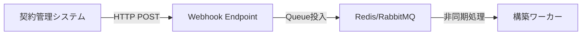
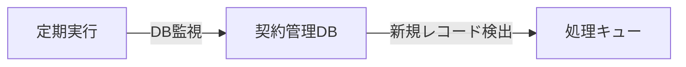
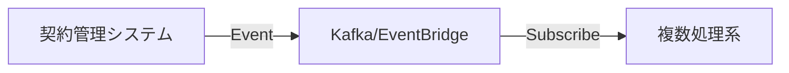
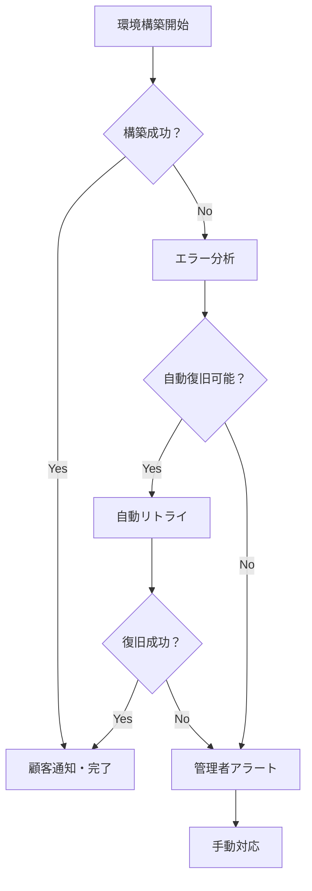

# 契約管理システム連携による自動環境構築アーキテクチャ

## 全体フロー概要



---

## 詳細アーキテクチャ

### 1. 契約管理システム連携



---

## 実装コンポーネント詳細

### 2. 契約管理システム（CRM）
```json
{
  "customer": {
    "id": "CUST-2025-001",
    "name": "ABC Corporation",
    "plan": "enterprise",
    "region": "ap-northeast-1",
    "storage_quota": "1TB",
    "user_limit": 100,
    "contract_date": "2025-05-29",
    "environment_status": "provisioning"
  }
}
```

**主な機能：**
- 顧客情報管理
- プラン・リソース設定
- 環境構築状況トラッキング
- **Webhook送信機能**（重要）

### 3. 環境構築オーケストレーター
```python
# 実装イメージ
class EnvironmentOrchestrator:
    def handle_new_customer(self, customer_data):
        try:
            # 1. 構築ジョブ作成
            job_id = self.create_provisioning_job(customer_data)
            
            # 2. Terraformテンプレート生成
            tf_config = self.generate_terraform_config(customer_data)
            
            # 3. インフラ構築実行
            infrastructure = self.provision_infrastructure(tf_config)
            
            # 4. アプリケーションデプロイ
            self.deploy_applications(infrastructure, customer_data)
            
            # 5. 顧客通知
            self.notify_customer_ready(customer_data)
            
        except Exception as e:
            self.handle_provisioning_failure(customer_data, e)
```

### 4. Terraformテンプレート動的生成
```hcl
# templates/customer-cluster.tf.j2
resource "aws_eks_cluster" "{{ customer_id }}_cluster" {
  name     = "{{ customer_id }}-cluster"
  role_arn = aws_iam_role.cluster_role.arn
  
  vpc_config {
    subnet_ids = {{ subnet_ids }}
  }
  
  tags = {
    Customer = "{{ customer_id }}"
    Plan     = "{{ plan }}"
    Environment = "production"
  }
}
```

---

## トリガー方式の選択肢

### Option 1: Webhook方式 🌟推奨


**メリット：**
- リアルタイム性が高い
- 実装が単純
- 失敗時の再試行が容易

### Option 2: ポーリング方式


**メリット：**
- システム結合度が低い
- バッチ処理で安定

### Option 3: イベントストリーミング


**メリット：**
- 拡張性が高い
- 複数システム連携が容易

---

## 失敗ハンドリング戦略

### 構築失敗時の対応フロー


### エラー分類と対応
| エラー種別 | 自動対応 | 手動対応 | 顧客通知 |
|------------|----------|----------|----------|
| **一時的障害** (AWS API制限等) | ✅ 自動リトライ | - | 遅延通知のみ |
| **設定エラー** (無効なリージョン等) | - | ✅ 設定修正 | エラー通知 |
| **リソース不足** (クォータ超過等) | - | ✅ リソース追加 | 遅延通知 |
| **アプリ障害** (Docker Image不存在等) | ✅ 別バージョン試行 | 必要に応じて | エラー通知 |

---

## 顧客通知システム

### 構築完了通知例
```email
件名: [重要] AIチャットボット環境が準備完了しました

ABC Corporation 様

お客様専用のAIチャットボット付きファイルサーバー環境が正常に構築されました。

■ アクセス情報
URL: https://abc-corp.your-service.com
初期管理者ID: admin@abc-corp.com
初期パスワード: [セキュアパスワード]

■ 環境仕様
- ストレージ容量: 1TB
- 最大ユーザー数: 100名
- リージョン: 東京 (ap-northeast-1)

■ 次のステップ
1. 初期ログイン・パスワード変更
2. ユーザー登録
3. AIチャットボット用ファイルアップロード

ご不明な点がございましたら、サポートチームまでお気軽にお問い合わせください。
```

---

## 実装ポイント

### 🔧 技術スタック例
```yaml
契約管理システム:
  - Backend: Django/Rails/Spring Boot
  - Database: PostgreSQL
  - Webhook: REST API

構築オーケストレーター:
  - Language: Python/Go/Node.js
  - Queue: Redis/RabbitMQ/AWS SQS
  - State Management: Database + ログ

インフラ構築:
  - IaC: Terraform/Pulumi
  - Container: Kubernetes
  - Cloud: AWS/GCP/Azure

通知システム:
  - Email: SendGrid/AWS SES
  - Slack: Webhook Integration
```

### 📊 監視・ログ
- **構築進捗**: リアルタイムダッシュボード
- **失敗率監視**: アラート設定
- **構築時間**: パフォーマンス監視
- **コスト追跡**: リソース使用量監視

---

## 実装タイムライン（概算）

| フェーズ | 期間 | 主な作業 |
|----------|------|----------|
| **Phase 1** | 2-3週間 | 契約管理システムへのWebhook機能追加 |
| **Phase 2** | 3-4週間 | 環境構築オーケストレーター開発 |
| **Phase 3** | 2-3週間 | Terraformテンプレート・Helmチャート作成 |
| **Phase 4** | 2週間 | 通知システム・監視システム構築 |
| **Phase 5** | 2週間 | テスト・デバッグ・ドキュメント作成 |

**合計: 11-16週間（約3-4ヶ月）**

このアプローチで問題ありませんか？特に契約管理システムとの連携部分で、現在のシステム構成や制約があれば教えてください。