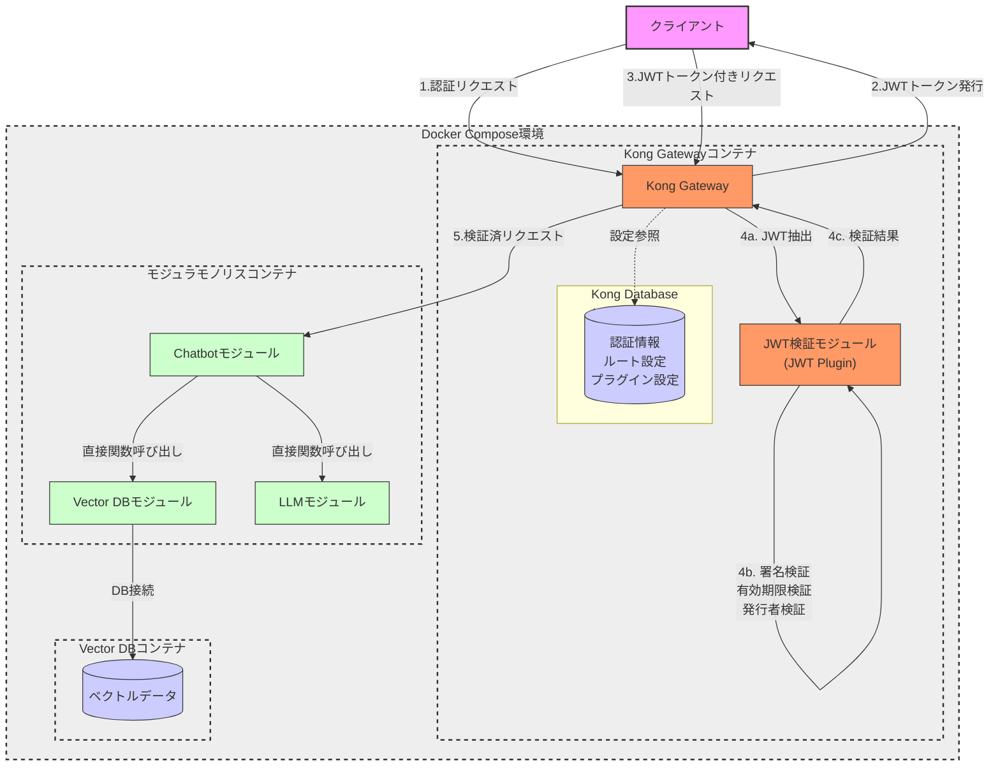
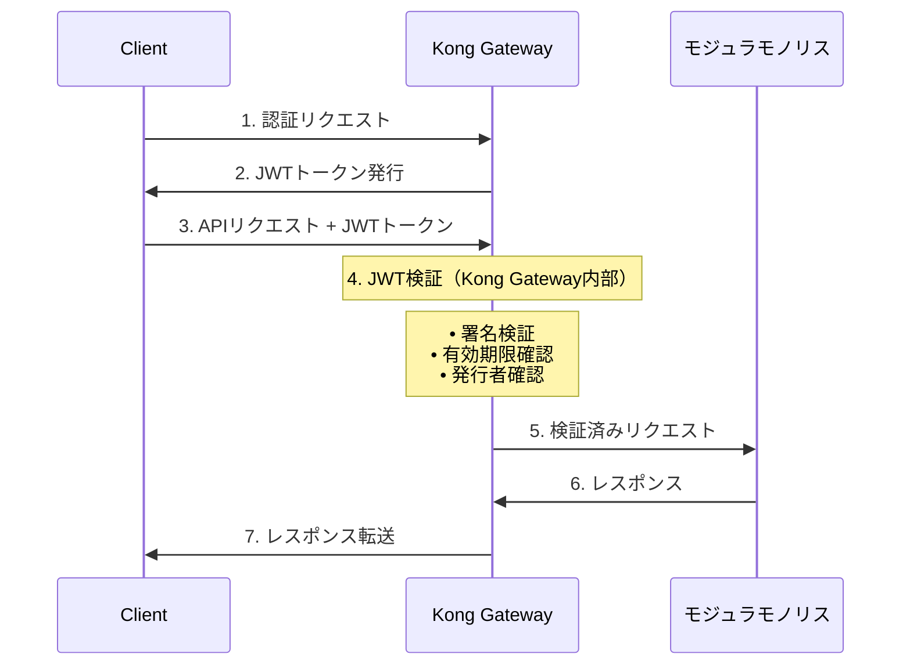

案１）Kubernetes をやめる
・API Gateway は採用
・API Gateway によるJET認証
・docker-compose によるコンテナ管理
・コンテナ間通信は？(kubernetes がないと複雑？)

案２）モジュラモノリス
・Kubernetes をやめる
・API Gateway は採用
・API Gateway によるJET認証
・docker-compose によるコンテナ管理
・ただし、モジュラモノリスとVectorDBのコンテナのみ
・モジュール間は直接関数呼び出し

メリット
・複雑化の回避
・将来的なマイクロサービスへの移行ができる

デメリット
・スケーリングが難しい

メモ
・時間がないなかでの最良の選択肢か
・Kubernetes に挑戦するにはあまりにも時間が足りなさすぎる
・モジュラモノリスは将来を考慮した良い選択肢の可能性が高い

参考：https://qiita.com/tkyowa/items/ae9fa550237cb6f48318