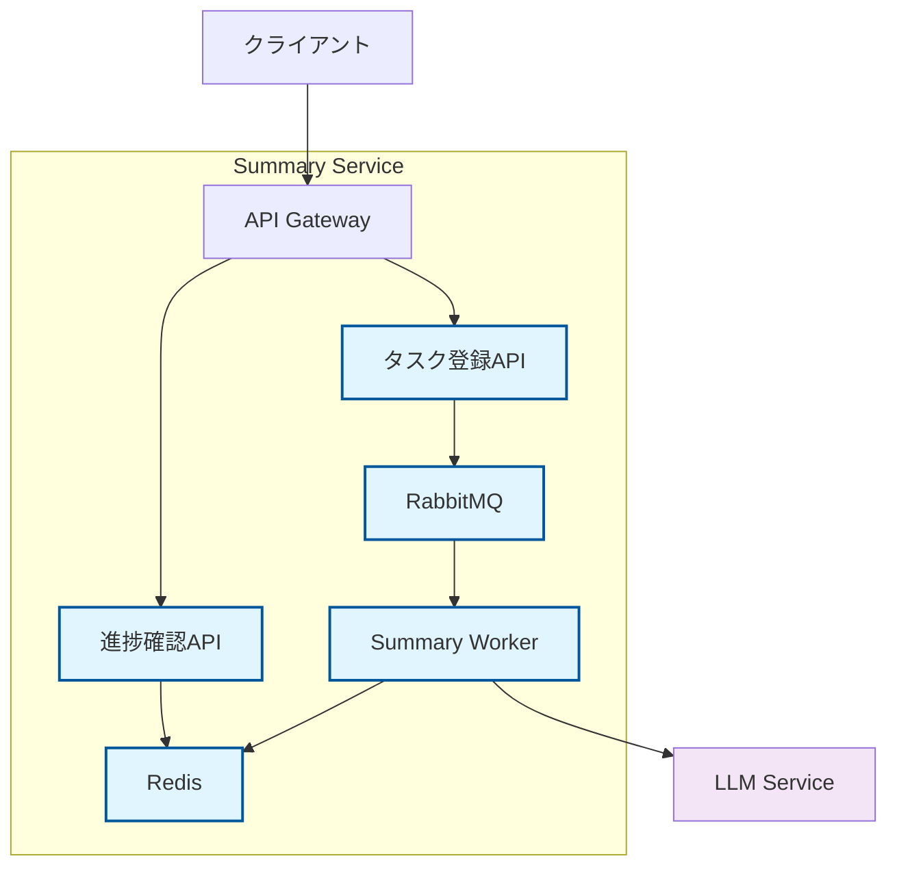
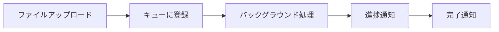
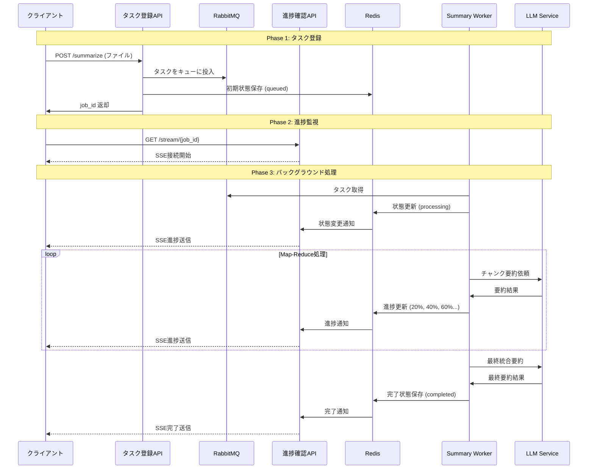
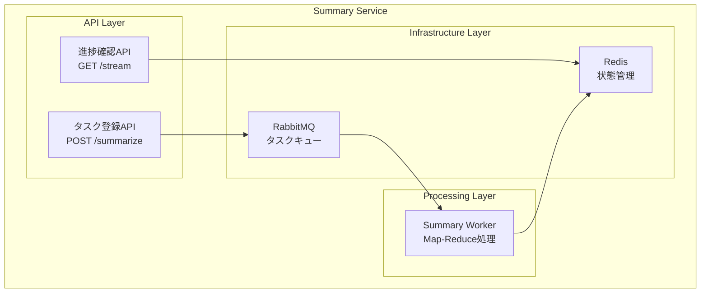
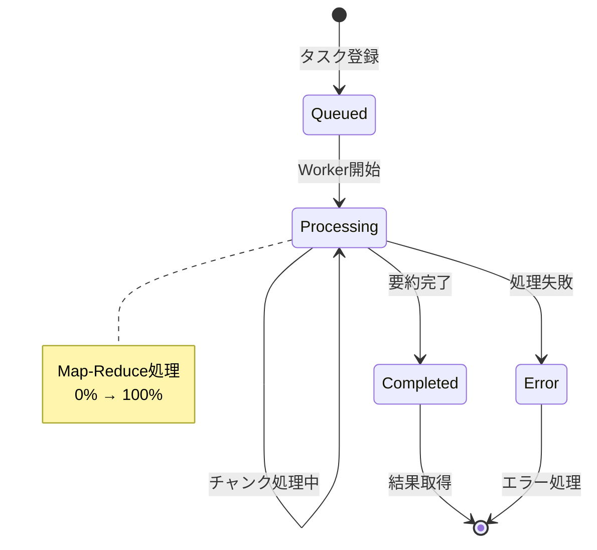
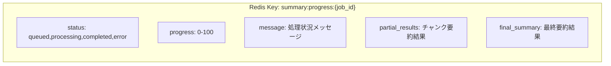
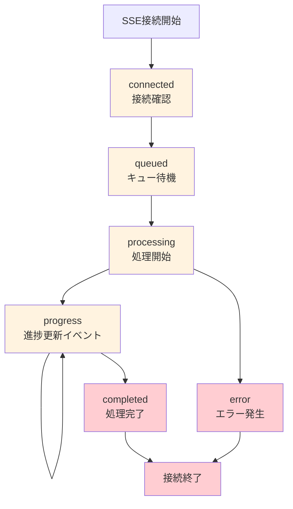
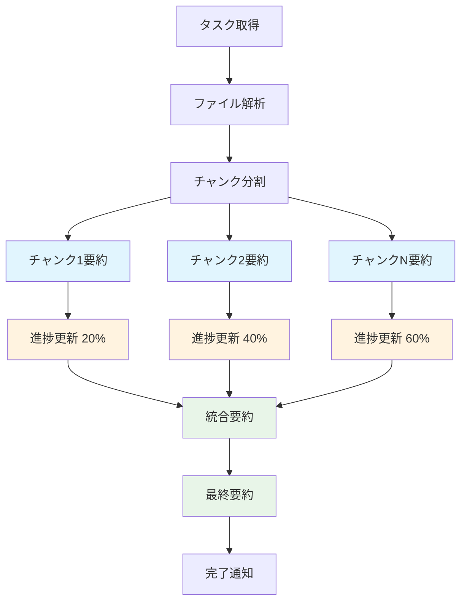
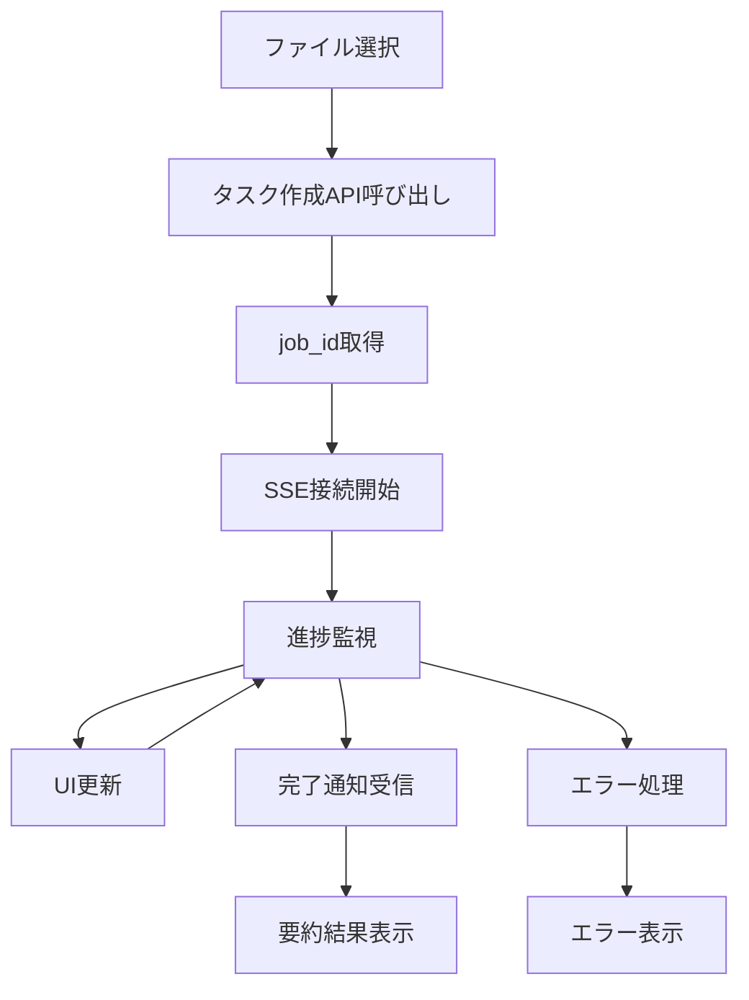

# Summary Service: SSE + RabbitMQ 非同期要約アーキテクチャ

## 概要

**Summary Service**は、大きなファイルの要約処理において発生するタイムアウト問題を解決するため、**RabbitMQ**による非同期処理と**SSE（Server-Sent Events）**によるリアルタイム進捗通知を組み合わせたアーキテクチャです。

---

## 全体アーキテクチャ

### サービス構成


---

## 基本的な仕組み

### 1. 2つのAPIによる責任分離

| API | エンドポイント | 役割 |
|-----|---------------|------|
| **タスク登録API** | `POST /api/v1/summarize` | ファイル受信、タスクキューイング |
| **進捗確認API** | `GET /api/v1/summarize/{job_id}/stream` | SSE接続、リアルタイム進捗通知 |

### 2. 非同期処理の流れ


---

## 詳細処理フロー

### 全体シーケンス


---

## コンポーネント詳細

### Summary Service 内部構成


### 各コンポーネントの役割

| コンポーネント | 役割 |
|----------------|------|
| **タスク登録API** | ファイル受信、バリデーション、キューへの投入 |
| **進捗確認API** | SSE接続管理、Redisからの状態取得、進捗配信 |
| **RabbitMQ** | タスクの非同期キューイング、ワーカーへの配信 |
| **Summary Worker** | 実際の要約処理、LLM連携、進捗更新 |
| **Redis** | 処理状態の保存、進捗情報の管理 |

---

## 状態管理

### ジョブの状態遷移


### Redisでの状態データ


---

## SSE進捗通知

### イベントの種類


### 進捗通知データ例
```json
{
  "status": "processing",
  "progress": 60,
  "message": "チャンク 3/5 要約中...",
  "partial_results": [
    {"chunk": 1, "summary": "第1章の要約..."},
    {"chunk": 2, "summary": "第2章の要約..."},
    {"chunk": 3, "summary": "第3章の要約..."}
  ]
}
```

---

## Summary Worker の処理詳細

### Map-Reduce処理フロー


---

## クライアント側処理パターン

### 基本的な利用フロー


---

## アーキテクチャのメリット

### 解決される課題
| 従来の問題 | 解決方法 |
|------------|----------|
| **タイムアウト** | 非同期処理により即座にレスポンス |
| **ユーザー体験** | SSEによるリアルタイム進捗表示 |
| **サーバー負荷** | バックグラウンド処理で負荷分散 |
| **エラーハンドリング** | 各段階での適切な状態管理 |

### 主要な利点
- **即座のフィードバック**: タスク登録完了を即座に通知
- **透明性**: 処理進捗をリアルタイムで確認可能
- **信頼性**: RabbitMQによる確実なタスク配信
- **拡張性**: ワーカー数の調整で処理能力拡張可能

---

## パターン名称

この設計は以下のパターンの組み合わせです：

- **Long Running Task Pattern**: 長時間処理の非同期化
- **Asynchronous Request-Reply Pattern**: リクエスト/レスポンスの分離
- **Event-Driven Architecture**: 状態変更によるイベント通知

**一般的な呼び方**: 「非同期タスク処理 + リアルタイム進捗通知アーキテクチャ」