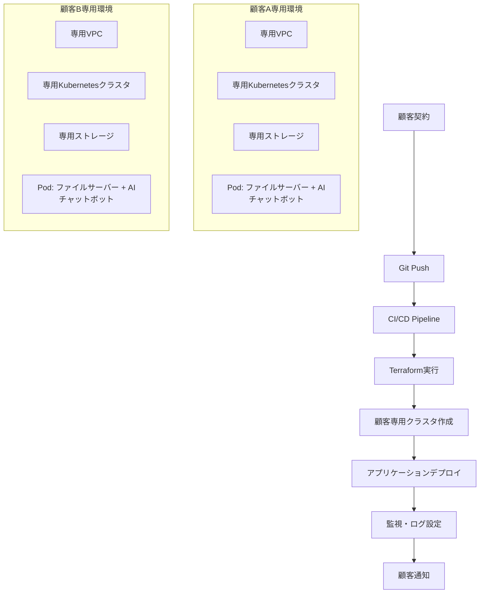

参考
https://claude.ai/share/e8b991de-c314-4de5-b9ef-6ae28feefb9c

微妙？
https://claude.ai/share/6402bd00-41ea-4adf-9897-0171a4001c47

---

# マルチテナント・ファイルサーバーシステムの技術検討まとめ

## 📝 **議論の経緯**

### **初期構想**
- **現状**: モノリシックなファイルサーバーシステム
- **目標**: コンテナ化してKubernetesで管理、顧客契約時の自動環境構築
- **追加機能**: AIチャットボット機能の実装

### **アーキテクチャの明確化**
- **認識確認**: マルチテナントアーキテクチャ（✅正解）
- **マイクロサービスとの違い**: 
  - マルチテナント = **誰に提供するか**（複数顧客への同じシステム提供）
  - マイクロサービス = **どう構築するか**（アプリケーションの分割手法）

### **技術的実装方式**
- **コンテナ構成**: Pod内でファイルサーバー + AIチャットボット（サイドカーパターン）
- **初期案**: 顧客ごとのノード分離
- **セキュリティ要件**: データ混在を絶対に避ける（非常に高い要件）

## 🔒 **セキュリティ要件の深掘り**

### **高セキュリティ要件の判明**
- ファイルサーバーデータの完全分離が必須
- AIチャットボットの学習データ・生成データの分離が必須
- 他顧客との情報混在リスクの完全排除

### **分離レベルの検討**

| 分離レベル | セキュリティ | 運用効率 | コスト | 推奨度 |
|------------|-------------|----------|--------|--------|
| **Namespace分離** | ❌ 低 | ✅ 高 | ✅ 低 | ❌ |
| **ノード分離** | ⚠️ 中 | ⚠️ 中 | ⚠️ 中 | ⚠️ |
| **クラスタ分離** | ✅ 高 | ❌ 低 | ❌ 高 | ✅ |

## ⚠️ **Namespace・ノード分離のリスク**

### **技術的リスク**
- **共有リソースリスク**: コントロールプレーン、etcd、ネットワーク
- **メモリダンプ攻撃**: 物理メモリでの他テナントデータ混在
- **カーネル脆弱性**: コンテナエスケープによる権限昇格
- **ネットワーク盗聴**: 同一セグメントでのパケット傍受
- **ストレージ残存**: 削除データの物理ディスク残存

### **運用リスク**
- **設定ミス**: RBAC、NetworkPolicy、ResourceQuota
- **監査ログ混在**: 他テナント情報の意図しない表示
- **アップデート影響**: 全テナントへの同時影響

### **統計データ**
- 67%の組織がKubernetesセキュリティ懸念で開発遅延
- 46%の組織がインシデントで収益・顧客損失

## 🏢 **クラスタ分離の実採用状況**

### **業界別採用傾向**
- **金融・保険業界**: 規制要件により標準採用
- **医療業界**: 患者データ保護のため必須
- **政府機関**: 国家機密保護要件
- **一般企業**: セキュリティ重視企業で採用増加

### **実際の採用事例**
- **IIJ**: 数百テナントのマルチテナント運用（Namespace分離）
- **電通国際情報サービス**: 金融向けSaaSでマルチテナント
- **多くの企業**: マルチクラスタ戦略への移行

### **市場動向**
- Kubernetes採用率: 78%（2024年）
- マルチクラウド・マルチクラスタへの移行加速
- セキュリティ重視でクラスタ分離採用増加

## 🚀 **環境構築自動化の実現性**

### **技術的実現性**
- **Infrastructure as Code**: Terraform、Pulumi等で完全自動化
- **GitOpsワークフロー**: Git push → 自動環境構築
- **CI/CD統合**: GitHub Actions、GitLab CI等との連携

### **自動化可能範囲**
- ✅ クラウドリソース作成（VPC、セキュリティグループ、IAM）
- ✅ Kubernetesクラスタ構築（マスター、ワーカーノード）
- ✅ 専用ストレージ・データベース作成
- ✅ アプリケーションデプロイ（ファイルサーバー、AIチャットボット）
- ✅ 監視・ログ設定（顧客別ダッシュボード）
- ✅ SSL証明書・DNS設定

### **自動化メリット**
- **構築時間**: 手動数日 → 自動数時間
- **ヒューマンエラー**: ゼロ化
- **コスト削減**: 大幅削減
- **品質保証**: 設定統一性確保

---

## 🎯 **推奨最適構成**

### **アーキテクチャ: 完全クラスタ分離 + 自動化**



### **1. 基盤アーキテクチャ**

#### **完全クラスタ分離**
- **顧客専用クラスタ**: 1顧客1クラスタの完全分離
- **専用ネットワーク**: VPC/VNet完全分離
- **専用ストレージ**: 暗号化キーも顧客別
- **専用監視**: 顧客別ダッシュボード・アラート

#### **マルチクラウド対応**
- **プライマリ**: AWS/Azure/GCP から選択
- **DR対応**: 異なるクラウドでのバックアップクラスタ
- **地域分散**: 規制要件に応じた地域選択

### **2. アプリケーション構成**

#### **サイドカーパターン**
```yaml
apiVersion: apps/v1
kind: Deployment
metadata:
  name: customer-application
  namespace: customer-${CUSTOMER_ID}
spec:
  template:
    spec:
      containers:
      - name: fileserver
        image: ${FILESERVER_IMAGE}
        ports:
        - containerPort: 8080
        volumeMounts:
        - name: shared-storage
          mountPath: /data
      - name: ai-chatbot
        image: ${CHATBOT_IMAGE}
        ports:
        - containerPort: 3000
        volumeMounts:
        - name: shared-storage
          mountPath: /shared
      volumes:
      - name: shared-storage
        persistentVolumeClaim:
          claimName: customer-storage
```

#### **セキュリティ強化**
- **Pod Security Standards**: Restricted レベル
- **Network Policies**: 厳格なトラフィック制限
- **Service Mesh**: Istio/Linkerd での暗号化
- **Image Scanning**: 脆弱性自動検知
- **Secrets Management**: 外部Key Vault連携

### **3. 自動化基盤**

#### **Infrastructure as Code**
```terraform
# main.tf
module "customer_environment" {
  source = "./modules/customer-cluster"
  
  customer_id = var.customer_id
  region = var.region
  
  # セキュリティ設定
  enable_encryption = true
  encryption_key_rotation = true
  
  # ネットワーク設定
  vpc_cidr = var.customer_vpc_cidr
  enable_private_endpoints = true
  
  # Kubernetes設定
  k8s_version = "1.31"
  node_count = var.node_count
  node_type = var.node_type
  
  # アプリケーション設定
  fileserver_config = var.fileserver_config
  ai_chatbot_config = var.ai_chatbot_config
}
```

#### **GitOpsワークフロー**
```yaml
# .github/workflows/deploy.yml
name: Customer Environment Deployment
on:
  push:
    paths: ['customers/*/']
jobs:
  deploy:
    runs-on: ubuntu-latest
    steps:
    - uses: actions/checkout@v4
    - name: Setup Terraform
      uses: hashicorp/setup-terraform@v3
    - name: Terraform Plan
      run: terraform plan -var-file=customers/${{ github.event.customer_id }}/terraform.tfvars
    - name: Terraform Apply
      run: terraform apply -auto-approve
    - name: Deploy Applications
      run: |
        kubectl apply -f customers/${{ github.event.customer_id }}/manifests/
    - name: Run Tests
      run: |
        pytest tests/integration/
    - name: Notify Customer
      run: |
        ./scripts/notify_customer.sh ${{ github.event.customer_id }}
```

### **4. 監視・運用**

#### **顧客別監視**
- **Prometheus**: 顧客別メトリクス収集
- **Grafana**: 顧客専用ダッシュボード
- **Alert Manager**: 顧客別アラート設定
- **Log Aggregation**: ELKスタック/Fluentd

#### **セキュリティ監視**
- **Falco**: ランタイムセキュリティ監視
- **Trivy**: 脆弱性スキャン
- **OPA Gatekeeper**: ポリシー強制
- **Audit Logging**: 顧客別監査ログ

### **5. 運用プロセス**

#### **顧客オンボーディング**
1. **契約完了** → システム自動通知
2. **Git Repository更新** → 顧客設定ファイル追加
3. **CI/CD Pipeline実行** → 環境自動構築（2-4時間）
4. **統合テスト実行** → 自動品質確認
5. **顧客通知** → アクセス情報自動送信

#### **日常運用**
- **自動バックアップ**: 顧客データの日次バックアップ
- **自動スケーリング**: 負荷に応じた自動調整
- **自動更新**: セキュリティパッチ自動適用
- **ヘルスチェック**: 24/7自動監視

### **6. コスト最適化**

#### **リソース最適化**
- **スポットインスタンス**: 非本番環境での活用
- **Auto Scaling**: 需要に応じた自動調整
- **Reserved Instances**: 長期利用での割引適用
- **コスト監視**: 顧客別コスト可視化

#### **運用効率化**
- **自動化率**: 95%以上の作業自動化
- **エラー率**: ヒューマンエラーの完全排除
- **復旧時間**: 障害時の自動復旧（RTO < 1時間）

---

## 📊 **実装ロードマップ**

### **Phase 1: 基盤構築（2-3ヶ月）**
- [ ] Infrastructure as Code テンプレート作成
- [ ] 基本的なKubernetesクラスタ自動構築
- [ ] CI/CD Pipeline構築
- [ ] セキュリティ基盤実装

### **Phase 2: アプリケーション統合（1-2ヶ月）**
- [ ] サイドカーパターンでの実装
- [ ] AIチャットボット統合
- [ ] 監視・ログ機能実装
- [ ] 統合テスト自動化

### **Phase 3: 運用自動化（1ヶ月）**
- [ ] 顧客オンボーディング自動化
- [ ] 障害対応自動化
- [ ] コスト最適化機能
- [ ] 運用ダッシュボード

### **Phase 4: 改善・拡張（継続）**
- [ ] パフォーマンス最適化
- [ ] 新機能追加
- [ ] マルチクラウド対応
- [ ] DR/BCP強化

---

## 🎯 **最終提言**

**高セキュリティ要件を満たしつつ、運用効率を最大化する最適解**

1. **完全クラスタ分離**: データ混在リスクの根本的排除
2. **サイドカーパターン**: ファイルサーバー + AIチャットボットの効率的実装
3. **完全自動化**: 契約から環境構築までの無人化
4. **GitOpsワークフロー**: 品質保証と変更管理の自動化
5. **包括的監視**: セキュリティと運用の両面監視

この構成により、**セキュリティ、運用効率、コスト効率の三位一体を実現**し、顧客の信頼を獲得しながらビジネスのスケーラビリティを確保できます。